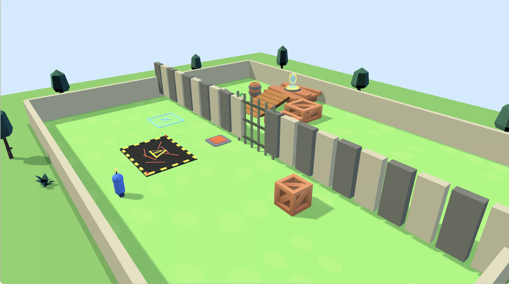

# Infinite 3D Environment Generation with Verifiable Agent Tasks

Generate playable 3D environments from text, define benchmark tasks, and verify
agent trajectories against deterministic code-level objectives.

Codex constructs scenes through typed tools, we use the MuJoCo physics engine, and Three.js renders the styled view. Every task requires a passing
human oracle before agent evaluation.



*Included courtyard demo generated through a multi-turn conversation.*


## Setup Instructions

Install [uv](https://docs.astral.sh/uv/getting-started/installation/) and the
[Codex CLI](https://developers.openai.com/codex/cli/), then authenticate once:

```bash
codex login
```

Clone the repository, install Chromium and its system dependencies, then start
Studio:

```bash
git clone https://github.com/sramesh64/3D-environment-generation.git
cd 3D-environment-generation
uv run playwright install --with-deps chromium
uv run environment-generation
```

The Playwright command installs the project Python, locked dependencies,
Chromium, and any required browser libraries. It may request administrator
permission on Linux. Studio opens at `http://127.0.0.1:3033`.

## Try It

1. Select **New Environment** and enter a name.
2. Describe a scene, for example:

   > Place a blue robot in the bottom-right corner, a pushable crate in the
   > center, and a cyan target region in the top-left.

3. Watch Codex build and verify the environment.
4. Continue editing with natural-language instructions or select **Play**.

Open **Primitives** in Studio to inspect every available building block.

**Controls:** `WASD` or arrow keys to move, `Space` to jump, `R` to reset, and
`Esc` to stop.

## Included Example

**example environment - courtyard** is a multi-turn demo with a switch-operated gate, hazard
route, ramp, pushing lane, climbable steps, and camera-relative placement. It
includes the source spec, MuJoCo world, styled scene, verification reports,
agent test run, and oracle-validated task.

## Environment Generation

1. **Interpret.** Codex receives the prompt, scene, conversation, and submitted
   camera context, then applies typed catalog operations through MCP.
2. **Compile.** `env_spec_3d.json` produces aligned MuJoCo `world.xml` physics
   and a styled Three.js `visual_scene.json`.
3. **Verify.** Deterministic checks validate the requested layout and physics;
   critical failures trigger repair before finalization.
4. **Persist.** The spec, outputs, checks, and history are saved together so
   later prompts can revise the same environment.

A fixed catalog of agents, terrain, obstacles, props, zones, and mechanisms can
be arranged, scaled, stacked, and linked into many different environments.

## Verification

| System | Purpose |
| --- | --- |
| **Environment checks** | Deterministic prompt-derived checks. Critical failures block finalization. |
| **VLM review** | Reviews three styled camera views for visible omissions and regressions. |
| **Agent tests** | Runs bounded MuJoCo trials to probe requested affordances such as climbing or pushing. |
| **Tasks** | Converts a benchmark instruction into deterministic trajectory tests. A human oracle must pass before agent evaluation. |

MuJoCo replay is authoritative. Visual review and agent narration provide useful
evidence, but they never replace code-level simulator truth.

## Useful Commands

| Purpose | Command |
| --- | --- |
| Start Studio | `uv run environment-generation` |
| Use another port | `uv run environment-generation --port 3040` |
| Check the installation | `uv run environment-generation-doctor` |
| Run the MCP server | `uv run environment-generation-mcp` |
| Run all tests | `uv run --extra test pytest` |

If Chromium setup fails, rerun
`uv run playwright install --with-deps chromium` and retry.
